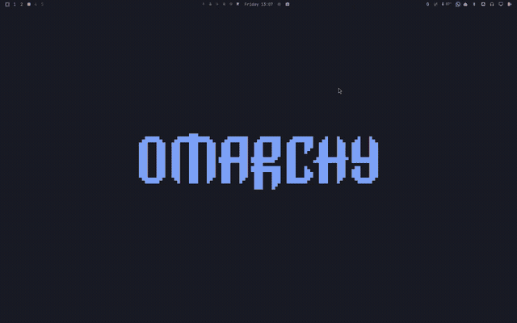
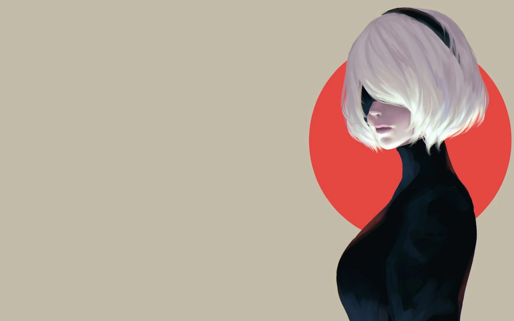
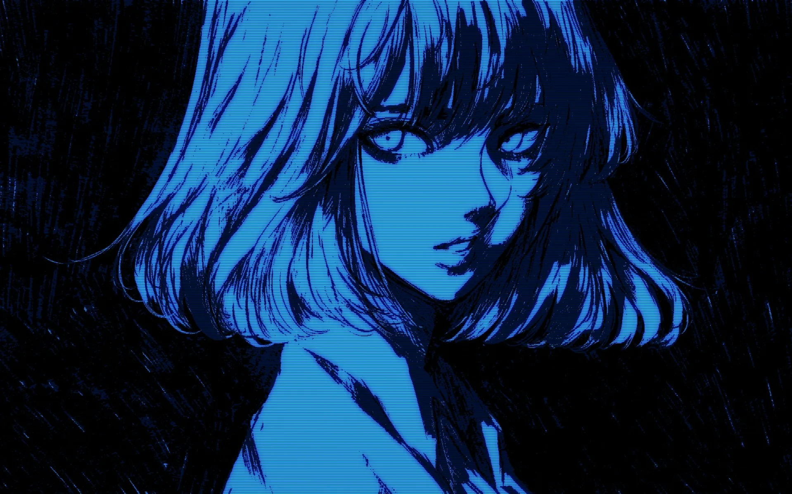
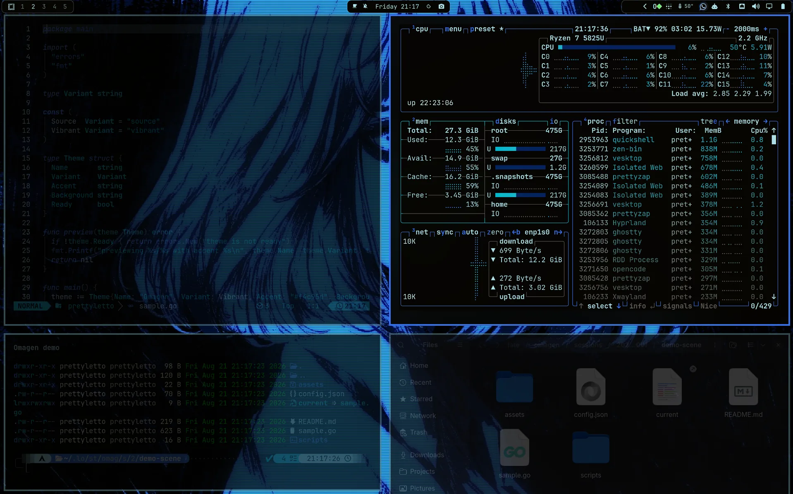

<div align="center">

# Omagen

**An image-to-theme studio for Omarchy Quattro**

Generate a palette from an image, explore six directions, preview the result
on your desktop, and apply the one that feels right.

</div>



## Video walkthrough

[](https://youtu.be/Af06-XsdBHA)

Watch the full walkthrough on [YouTube](https://youtu.be/Af06-XsdBHA).

## Install

Install and enable Omagen through Omarchy:

```sh
omarchy plugin add https://github.com/prettyletto/omarchy-themegen.git --enable --yes
```

That is the complete user installation. Omarchy clones the plugin, validates
its manifest, enables it, and places the widget in its declared default bar
section. Go is not required because the runtime backend is bundled with the
plugin.

## How it works

| Step | In Omagen | Result |
| --- | --- | --- |
| 1 | Choose an image | Omagen extracts representative colors. |
| 2 | Explore the gallery | Six directions are generated: Source, Calm, Mute, Deep, Vibrant, and Balanced. |
| 3 | Test the direction | Preview it live or open a temporary Demo workspace. |
| 4 | Apply the result | Save a named, permanent Omarchy theme. |

The preview uses the same production palette and semantic-contrast pipeline as
the applied theme, so the gallery represents the colors that will actually be
written to the theme.

## Examples

### Kanaawesome — Kanagawa Waves

An image-derived Omagen theme generated from a Kanagawa-style wave wallpaper:

<p align="center">
  
  
</p>

### NieR:Automata — 2B Sunset

An image-derived Omagen theme generated from a NieR:Automata-inspired wallpaper:

<p align="center">
  
  
</p>

### Ushinawareta — 失われた

An image-derived Omagen theme generated from a neon anime wallpaper:

<p align="center">
  
  
</p>

### Neon Blue

An image-derived Omagen theme generated from a blue scanline anime wallpaper:

<p align="center">
  
  
</p>

See the [Examples gallery](docs/examples.md) for the complete set of generated themes.

## Features

- Image-derived Omarchy palettes with six visual directions.
- Live previews inside a recoverable Omagen session.
- Optional Window, Shell, and Bar composition previews, including animated
  borders, border thickness, inactive-window treatment, shell feedback
  surfaces, and Docked-bar visibility.
- Temporary Demo workspace with editor, terminal, system-monitor, and
  file-manager views.
- Capability detection and useful fallbacks when preferred Demo applications
  are unavailable.
- Optional Plymouth unlock-screen artwork.
- Optional capture of the live Demo workspace as `preview.png`.
- Keyboard and mouse navigation, including arrows and `h/j/k/l`.
- Crash-safe Apply, Cancel, Quit, and recovery flows.

The optional composition controls shape generated theme files without taking
ownership of Quattro's native widget layout, ordering, transparency, or input.
See [Styling and palette settings](docs/styling.md) for the complete option
matrix.

## Screenshots

### Using Omagen

Start with an image, review the generated directions, and tune the palette
defaults from Settings:

<p align="center">
  
  
</p>

<p align="center">
  
</p>

### Extra desktop composition

Enable the optional composition step to preview how the generated palette can
shape Window, Shell, and Bar surfaces while keeping Quattro's native layout:


## First run

After installation, click the Omagen widget in the Quattro bar:

1. Choose an image.
2. Optionally enable extra Window, Shell, and Bar configuration previews.
3. Select a palette direction.
4. Use **Test live**, **Demo**, **Bar Demo**, or **Apply theme**. Bar Demo
   previews the staged BarSpec motion and topology below the real native bar;
   it does not replace Quattro's widgets or input ownership.

Use **Cancel** to restore the original theme and background. If Omagen is
interrupted during a preview, its next launch offers **Restore & close** or
**Resume** when the generated workspace is still available.

Right-click the bar widget for **Open**, **Settings**, and **Quit**. Quit uses
the same restore path as Cancel when an active session exists.

## Requirements and integration

- Omarchy Quattro
- Hyprland
- Quickshell
- Linux x86_64 for the bundled V1 backend binary

Demo applications are optional. Omagen resolves available terminals, editors,
monitors, and file managers and provides fallbacks when a preferred
application is not installed.

Omagen preserves Quattro's native left, center, and right widget layout. Its
optional Docked bar form is an additive surface beneath the native widgets when
the native bar is opaque. Native transparency intentionally keeps this
decoration transparent, while the explicit Show islands policy can keep it
visible over a transparent native bar. Native widgets, layout, and input remain
Omarchy-owned. It falls back to the normal continuous bar when the active shell
does not expose the geometry hooks required for the three section surfaces.

Bar profiles are theme-bounded. A profile that only styles or decorates the
native bar leaves the user's layout untouched. A profile that explicitly owns
the layout or selects a replacement is applied through a reversible adapter:
Omagen snapshots the exact user `shell.json` (and the native bar hidden toggle)
before applying it, then restores that snapshot on Cancel, Restore, theme
switch, or recovery. Replacement bars remain opt-in and must provide a native
Quattro fallback.

## Documentation

| Guide | Audience | Covers |
| --- | --- | --- |
| [Usage](docs/usage.md) | Users | The complete workflow from image selection to Apply. |
| [Styling and palette settings](docs/styling.md) | Users | Harmony, contrast, Window, Shell, Bar, and generated assets. |
| [Demo workspace](docs/demo.md) | Users | Temporary workspaces, capability resolution, fallbacks, and preview capture. |
| [Recovery and safety](docs/recovery.md) | Users and maintainers | Sessions, Cancel, Quit, Apply safety, and cleanup boundaries. |
| [Development](docs/development.md) | Contributors | Local installation, tests, linting, and the V1 validation gate. |
| [Architecture](docs/architecture.md) | Contributors | The plugin contract, QML/backend boundary, generation pipeline, and lifecycle. |

The [documentation index](docs/README.md) mirrors this table and the
[mdBook summary](SUMMARY.md) provides the rendered documentation navigation.

## Remove

```sh
omarchy plugin remove pretty.omagen --yes
```

Removing the plugin does not delete user-created permanent themes. Omagen
session state lives under `~/.local/state/omagen`; only remove that state
after confirming that no session is active.
