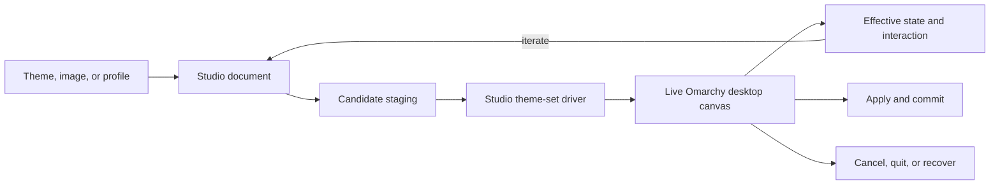

# Omarchy Studio nightly roadmap

Status: planning baseline

Branch: `nightly`

This roadmap turns Omagen into an Omarchy-native live Studio for Hyprland,
Quickshell, Qt Quick, the native bar, applications, and theme behavior. The
existing session, generation, Apply, Cancel, Quit, Back, Demo, cleanup, and
recovery engine remains the safety core. The roadmap changes the control surface
and expands the capabilities around that core.

## Product north star

Omarchy Studio must let a user inspect, compose, apply, interact with, and
revert a real Omarchy desktop. The live desktop is the visual authority. Static
cards, HTML previews, and generated screenshots are summaries or evidence
artifacts, never substitutes for runtime proof.

The central loop is:

```text
Inspect → compose → apply live → interact → keep or revert
```

The product has two intentional paths:

- **Omarchy Defaults:** simple palette/theme application using native Omarchy
  shell, bar, Hyprland, workspace, and application behavior.
- **Advanced Studio:** explicit control of compositor, shell, bar, motion,
  applications, extensions, and other capabilities with live validation,
  cost/trust warnings, and rollback.

## Final UX contract

This is the target experience that the roadmap must implement. It is more
important than preserving the current page sequence or card layout.

### Entry point

Studio is discoverable from an Omarchy bar widget. A future `desktop.ini`
integration may add another entry point, but it is not required for the first
nightly slice.

The user opens Studio and sees a centered Studio start surface over a real
wallpaper. The start surface is a Quickshell surface, not an HTML application.

### Start flow

The first flow is deliberately simple:

1. Open **Omarchy Studio** from the bar widget.
2. Choose or confirm a wallpaper/theme source.
3. Choose the analysis depth:
   - **Fast:** quick palette extraction and the shortest path to a live canvas.
   - **In-depth:** richer image analysis and additional palette/profile metadata.
4. Generate approximately six palette variants.
5. Show the variants with a clear instruction: **Choose a palette to start**.
6. Select one palette.
7. Enter Live Mode immediately.

The six variants are starting directions, not final static previews. The user
should reach the real desktop quickly.

### Live Mode

Live Mode is the central Studio product:

- the real Omarchy desktop is the canvas;
- wallpaper, shell, bar, windows, applications, and compositor behavior are
  observed live;
- the user may open a browser, terminal, editor, or other representative apps;
- settings do not silently mutate the live desktop merely because a control was
  clicked;
- the user changes settings, then chooses **Test Live**;
- Test Live applies the candidate through the Studio transaction and waits for
  the relevant runtime readers to settle;
- the user interacts with the result before deciding whether to keep it.

The old instant-card pattern must not be the primary proof. Small previews may
remain beside a setting as a compact explanation of the option, but the actual
decision happens on the live desktop.

### Persistent Studio control surface

During Live Mode, Studio becomes an always-available Quickshell control surface:

- a rectangular side panel attached to the desktop;
- collapsible to a narrow rail;
- hideable without ending the live session;
- reopenable through a floating button or compact Studio handle;
- keyboard and pointer accessible;
- never allowed to trap input when hidden;
- aware of the current monitor and live canvas state.

The panel contains the settings and actions needed to operate the live session:

- current palette/profile;
- Window, Shell, Bar, Application, Motion, and Advanced sections;
- **Test Live**;
- **Undo**;
- **Redo** where a reversible history exists;
- **Commit**;
- **Restore**;
- session status, pending operations, cost, trust, and validation evidence.

### Live transaction semantics

Every Test Live operation is a session mutation with a reversible checkpoint:

```text
Change settings
    ↓
Test Live
    ↓
Stage candidate and record checkpoint
    ↓
Apply to real Omarchy desktop
    ↓
Wait for relevant shell/Hyprland/application readers
    ↓
Interact and inspect
    ↓
Undo, continue iterating, Commit, or Restore
```

The history must distinguish:

- a setting change not yet tested;
- a tested live checkpoint;
- an undone checkpoint;
- the committed final state;
- the original session baseline.

**Undo** returns to the previous live checkpoint. **Restore** returns to the
original state captured when Studio opened. **Commit** makes the selected result
permanent and ends the live session. Closing or crashing must follow the existing
session recovery rules.

### Defaults and Advanced entry

The start flow should not force new users into the full capability surface.

After the first palette selection, the user can remain on **Omarchy Defaults**:

- palette and wallpaper;
- supported standard application theme outputs;
- native Omarchy shell, bar, Hyprland, workspace, and application behavior;
- no extra custom behavior unless explicitly enabled.

The user can enable **Advanced Studio** from the live side panel. Advanced mode
unlocks the full capability sections progressively and explains each operation's
owner, risk, cost, trust requirement, live reader, fallback, and rollback.

### Final decision points

The user must always have an obvious choice between:

- **Test Live:** apply a reversible candidate to the real canvas;
- **Undo:** return to the previous tested live state;
- **Restore:** abandon the session and restore the original desktop;
- **Commit:** keep the result and finish the session.

No setting should be presented as “applied” when it has only changed an
in-memory form or a static card.

## Architecture direction



The Studio owns orchestration and capability policy. Native Omarchy, Hyprland,
and Quickshell remain the runtime owners of the effects they already own.

## Non-negotiable invariants

- Keep the existing session and Apply transaction authoritative.
- Preserve durable `PREPARED` and `COMMITTED` recovery semantics.
- Keep Cancel and bar Quit as baseline-restoring aborts.
- Keep configuration Back session-aware and recovery-safe.
- Preserve unknown shell/layout/plugin fields.
- Do not edit `/usr/share/omarchy/`; it is package-owned.
- Do not delete or globally disable the user's Omarchy hooks.
- Studio preview uses an explicit owned allowlist instead of arbitrary hooks.
- Every visual effect has one native owner.
- Every generated artifact has a named runtime reader.
- Every live mutation has a rollback path.
- Static preview is never reported as live visual proof.
- `nightly` may experiment; `dev` integrates; `main` releases.

## Current foundation

The current repository already contains useful pieces:

- `backend/internal/session/`: session state, active record, recovery, and
  mutation locking.
- `backend/internal/generation/`: candidate generation and variant storage.
- `backend/internal/preview/`: temporary theme alias publication and live
  theme preview invocation.
- `backend/internal/apply/`: owned destination publication and transactional
  Apply/recovery.
- `backend/internal/demo/`: dedicated workspace, real application launch,
  placement, capture, close, and workspace restoration.
- `backend/internal/omarchy/`: current theme/background inspection and the
  process bridge to `omarchy theme set`.
- `qml/views/WorkspaceWindow.qml`: current preview, Demo, Apply, and recovery
  control surface.
- `qml/views/PreviewConfigWindow.qml`: current Window/Shell/Bar configuration
  page.
- `qml/components/ThemePreviewCard.qml`: current synthetic composition preview.
- `/usr/bin/omarchy-theme-set`: installed Omarchy theme compiler/apply script
  whose behavior must be versioned and adapted, not edited in place.

## Roadmap phases

### N0 — Freeze the stable engine contract

Goal: make the current backend a protected foundation before expanding Studio.

Tasks:

- [x] Document the current session state machine and ownership boundaries.
- [ ] Add contract tests for begin, resume, generation, preview, Apply, Cancel,
      Quit, configuration Back, crash recovery, and cleanup.
- [x] Record the exact current Apply ordering and recovery assumptions.
- [ ] Define which backend interfaces may evolve and which must remain stable.
- [ ] Define how new Studio capabilities attach to an active session.
- [x] Preserve the current CLI/package contract during the first nightly slices.

Done when:

- Existing session/apply tests are green.
- A failed live preview can restore the original theme and background.
- New Studio code can call the engine without owning duplicate rollback logic.

### N1 — Inventory and version the Omarchy theme pipeline

Goal: understand and own the theme-set boundary without modifying Omarchy's
package-owned files.

Tasks:

- [ ] Capture the installed `omarchy-theme-set` version and source hash.
- [ ] Inventory stock/user theme overlay precedence.
- [ ] Inventory built-in and user templates.
- [ ] Inventory generated outputs and their real readers.
- [ ] Inventory shell IPC and theme payload behavior.
- [ ] Inventory Hyprland reload and user-override ordering.
- [ ] Inventory post-apply application retint commands.
- [ ] Inventory arbitrary theme-set hooks and their side effects.
- [ ] Define a drift report for changes to the installed Omarchy script.

Done when:

- Studio can explain every output it is about to generate or preserve.
- An Omarchy update can be detected as a driver compatibility event.
- No Studio workflow depends on editing `/usr/share/omarchy/`.

### N2 — Build the Studio theme-set driver

Goal: replace the opaque `omarchy theme set` delegation with a Studio-owned,
versioned orchestration path.

Tasks:

- [x] Create a source-derived Studio driver in the plugin/repository boundary.
- [x] Preserve staging, locking, theme promotion, background transition, and
      shell payload semantics.
- [ ] Add explicit modes: preview, apply, restore, and inspect.
- [ ] Add explicit scope flags: theme, shell, Hyprland, apps, background.
- [ ] Add wait modes for critical promotion and full completion.
- [x] Add `--no-hooks` behavior for Studio preview.
- [x] Add a Studio-owned post-apply allowlist.
- [ ] Add an explicit opt-in for trusted user hooks where compatibility requires
      them.
- [ ] Bound and persist driver logs per session/generation.
- [ ] Verify the active theme and shell/Hyprland state after each critical step.
- [x] Make driver failure return to the session recovery path.

Suggested interface:

```text
studio-theme-set preview <candidate> [flags]
studio-theme-set apply <candidate> [flags]
studio-theme-set restore <session> [flags]
studio-theme-set inspect [flags]
```

Done when:

- A preview can apply live without arbitrary theme hooks.
- A failed driver invocation restores or remains safely recoverable.
- The driver reports exactly which native operations ran.

### N3 — Create the live Omarchy desktop canvas

Goal: turn the current Demo workspace into an interactive, truthful Studio
laboratory.

Tasks:

- [ ] Keep the current workspace/app ownership model and generalize it into a
      Studio canvas service.
- [ ] Start from the bar-widget entry point and keep future `desktop.ini` as an
      additive entry path.
- [ ] Open a centered wallpaper-first Studio start surface.
- [ ] Implement Fast and In-depth analysis modes.
- [ ] Move from the six starting palette variants into Live Mode immediately
      after selection.
- [ ] Allocate a dedicated workspace or special workspace deliberately.
- [ ] Launch a representative application corpus with stable owner markers.
- [ ] Include real shell/bar/popup surfaces where the selected profile affects
      them.
- [ ] Apply candidate themes through the Studio driver.
- [ ] Reflow the canvas after changes to gaps, rounding, scale, or layout.
- [ ] Let the user interact with windows, focus, workspaces, panels, popups, and
      bar modules while the candidate is active.
- [ ] Reapply changes without losing the session baseline.
- [ ] Keep Studio available as a collapsible, hideable live side panel.
- [ ] Provide a floating reopen handle without trapping hidden-surface input.
- [ ] Record every Test Live operation as a reversible checkpoint.
- [ ] Provide live Undo and final Restore actions.
- [ ] Close the canvas and restore workspace, theme, wallpaper, shell, and owned
      applications.
- [ ] Recover the canvas after shell or Hyprland reload failure.

Important boundary:

A dedicated workspace isolates the application's arrangement, but shell and
Hyprland behavior can remain global. The transaction and recovery engine must
continue to protect the whole desktop.

Done when:

- A user can see and interact with the actual theme on the real desktop.
- No HTML card is required to decide whether a live capability works.
- Cancel, Quit, Back, crash recovery, and external theme changes remain safe.

### N4 — Define the Studio document and live profiles

Goal: represent palette, behavior, assets, and runtime policy in one explicit
document that can be staged, diffed, applied, and reverted.

Core document areas:

- palette and semantic colors;
- wallpaper and asset collection;
- window/compositor behavior;
- shell surface tokens;
- bar composition and placement;
- motion and reduced-motion policy;
- application outputs;
- fonts and icons;
- plugins and extensions;
- hook policy;
- performance and trust policy.

Tasks:

- [ ] Define schema versioning and migrations.
- [ ] Define theme-scoped, Studio-preset, user-preference, and system-owned
      values.
- [ ] Define source/provenance for every document field.
- [ ] Define effective-value and override reporting.
- [ ] Define capability adapters and feature gates.
- [ ] Define live variant identity and deterministic profile naming.
- [ ] Define artifact ownership markers and cleanup rules.
- [ ] Define how a profile can be exported/imported safely.

Initial profiles:

- [ ] Omarchy Defaults.
- [ ] Minimal.
- [ ] Glass.
- [ ] High Contrast.
- [ ] Neon.
- [ ] Cinematic.
- [ ] Low Power.
- [ ] Custom Advanced.

Done when:

- A profile can produce a candidate directory and a human-readable diff.
- Every field maps to an owner, reader, impact level, and rollback path.

### N5 — Add the Omarchy Defaults path

Goal: make the safe/simple experience excellent before exposing advanced power.

Omarchy Defaults should apply:

- palette;
- selected wallpaper;
- supported standard application theme outputs;
- native Omarchy shell behavior;
- native bar layout and plugin placement;
- native Hyprland behavior;
- native workspace/layout policy.

It should not add custom behavior configuration unless the selected stock theme
already owns that behavior.

Tasks:

- [ ] Define the exact Defaults artifact allowlist.
- [ ] Suppress Studio-generated shell/bar/Hyprland behavior outside that list.
- [ ] Keep native Omarchy hooks out of preview by default.
- [ ] Provide a clear Defaults diff before Apply.
- [ ] Provide one obvious fallback to the current native configuration.
- [ ] Validate Defaults through the live canvas and real applications.

Done when:

- A new user can apply a palette/theme without understanding advanced config.
- Defaults never silently changes persistent monitor, input, bar, or workspace
      policy.

### N6 — Add Advanced Studio capabilities

Goal: expose the full live capability of Hyprland, Quickshell, Qt Quick, and
Omarchy without hiding risk.

Capability groups:

- [ ] Window borders, rounding, gaps, opacity, dimming, shadow, glow, and blur.
- [ ] Window/layer rules with verified classes, titles, and namespaces.
- [ ] Workspace modes, layouts, gestures, and monitor-aware behavior.
- [ ] Window/workspace/layer animation and reduced-motion controls.
- [ ] Quickshell panels, popups, overlays, services, and token consumers.
- [ ] Native bar widgets and additive decoration derived from live geometry.
- [ ] Explicit full-bar replacement with native fallback.
- [ ] Application templates, terminals, editors, browser chrome, and GTK state.
- [ ] Fonts, icons, keyboard color, and theme assets.
- [ ] Plugin installation, trust review, and lifecycle isolation.
- [ ] Hooks as explicit executable capabilities.
- [ ] Privileged/system styling as a separate gated workflow.

Every advanced control must expose:

- native owner;
- runtime reader;
- impact level;
- performance cost;
- trust/permission requirement;
- preview scope;
- fallback;
- validation evidence;
- rollback behavior.

### N7 — Repaginate the UI and UX

Goal: make the new live workflow understandable and fast.

Proposed navigation:

1. **Studio Home:** active theme, effective state, session health, and current
   canvas status.
2. **Source and Palette:** image/theme input and palette variants.
3. **Defaults or Advanced:** choose the safe path or unlock capabilities.
4. **Window Lab:** compositor decoration, opacity, blur, motion, and rules.
5. **Shell Lab:** panels, popups, overlays, tokens, and focus/input behavior.
6. **Bar Lab:** native layout, widgets, geometry, and additive decoration.
7. **Application Lab:** generated files, reload state, fonts, icons, and assets.
8. **Live Canvas:** real desktop interaction and evidence capture.
9. **Apply and Recover:** diff, permissions, cost, Apply, Cancel, Quit, and
   recovery state.

Tasks:

- [ ] Replace preview-first wording with live-canvas wording.
- [ ] Make the centered wallpaper-first start surface the first-run entry.
- [ ] Make Fast the default analysis path and In-depth explicitly selectable.
- [ ] Transition to Live Mode immediately after palette selection.
- [ ] Build the collapsible/hideable live side panel and floating reopen handle.
- [ ] Put Test Live, Undo, Restore, and Commit in the persistent control surface.
- [ ] Keep synthetic previews as compact summaries only.
- [ ] Add effective-value and provenance inspection.
- [ ] Add capability availability and unsupported-state explanations.
- [ ] Add cost/trust warnings before expensive or executable changes.
- [ ] Add explicit “live verified” versus “generated only” evidence labels.
- [ ] Preserve keyboard navigation, Escape, outside dismissal, and focus safety.
- [ ] Keep native Quattro bar ownership and interaction intact.

### N8 — Add cost, trust, and recovery communication

Goal: make advanced power understandable to users without pretending to predict
exact performance.

Each capability should show:

```text
Owner: Hyprland compositor
Scope: selected translucent windows
Cost: Medium GPU / battery impact
Trust: native config, no external process
Preview: live canvas required
Fallback: native opacity + dim
Rollback: session restore
```

Suggested cost presets:

- **Light:** small region, conservative blur/effects, battery-friendly.
- **Balanced:** recommended live desktop default.
- **Rich:** larger blur/passes, glow, and stronger motion.
- **Maximum:** advanced opt-in; may affect GPU, battery, or frame pacing.

Tasks:

- [ ] Estimate cost from surface area, passes, redraw frequency, and animation.
- [ ] Warn for fullscreen blur, persistent timers, motion blur, and stacked
      effects.
- [ ] Offer reduced-motion and low-power fallbacks.
- [ ] Mark executable Lua, QML plugins, and hooks as trust capabilities.
- [ ] Show exact rollback scope before Apply.

### N9 — Validate and promote through nightly → dev → main

Nightly gates:

- [ ] format, unit tests, vet, QML validation;
- [ ] Studio driver smoke test;
- [ ] no-hook preview test;
- [ ] live canvas test;
- [ ] shell reload and Hyprland reload/config-error test;
- [ ] Apply/Cancel/Quit/Back/crash recovery test;
- [ ] performance and reduced-motion sanity test.

Dev gates:

- [ ] full `GOCACHE=/tmp/omagen-gocache ./scripts/v1-check.sh`;
- [ ] development plugin reinstall;
- [ ] live Apply and rollback;
- [ ] native `omarchy plugin validate`;
- [ ] clean plugin installation and bundled backend ping;
- [ ] representative live canvas session.

Main gates:

- [ ] hosted CI;
- [ ] fresh clone validation;
- [ ] exact package manifest and executable validation;
- [ ] one-command install validation;
- [ ] stable session recovery and rollback;
- [ ] release notes for capability and trust changes.

## First implementation slice

The first code slice after this roadmap is:

> **Studio Live Canvas v1:** introduce a Studio-owned theme-set driver with
> explicit no-hook/allowlist behavior, connect it to the existing Demo
> workspace and session rollback engine, and prove one real live theme change
> from preview through restore.

This slice should not attempt to repaginate the complete UI or expose every
Hyprland/Quickshell option. It should prove the new live foundation first.

## Decision log

- The current engine remains the safety core.
- Omarchy's package-owned files remain read-only.
- Studio owns its theme-set orchestration path.
- Arbitrary hooks are not part of default live preview.
- Live desktop behavior is the visual authority.
- Omarchy Defaults is the simple path.
- Advanced Studio is explicit, capability-gated, and reversible.
- `nightly` is experimental, `dev` is integration, and `main` is stable.

## Progress log

Update this section after each completed slice:

```text
Date: 2026-08-22
Slice: Studio theme-set driver, fast Apply, recovery, and cache-warm wrap-up
Branch: nightly
Changed owners: Omagen backend Apply/Preview/Omarchy client, Studio driver,
  Workspace recovery UI, development documentation
Validation evidence: full v1-check.sh PASS; Go tests, race tests, vet, QML
  validation, package validation; source/installed driver and backend hashes match
Live visual evidence: user confirmed Apply and the recovery-safe UI worked
  correctly; native theme-picker cache warm-up is installed and awaiting one
  post-install latency observation
Rollback evidence: Apply failure recovery, prepared/committed recovery, Cancel,
  Quit, generation Back, and ownership-protected cleanup are covered by tests
Known limitations: explicit restore/inspect driver modes, scope flags, trusted
  hook opt-in, drift reporting, and the Live Canvas remain future work
Next slice: N3 Live Omarchy desktop canvas
```
