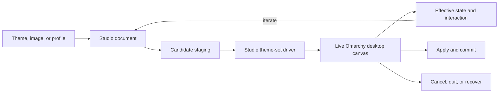

# Omarchy Studio nightly roadmap

Status: N3 Live Canvas v1, N3.1 color studio, and N3.2 window composition
foundation implemented; the four-engine split is implemented; live desktop proof pending

Branch: `nightly`

This roadmap turns Omagen into an Omarchy-native live Studio for Hyprland,
Quickshell, Qt Quick, the native bar, applications, and theme behavior. The
existing session, generation, Apply, Cancel, Quit, Back, Demo, cleanup, and
recovery engine remains the safety core. The roadmap changes the control surface
and expands the capabilities around that core.

## Product north star

Omarchy Studio must let a user inspect, compose, apply, interact with, and
revert a real Omarchy desktop. The live desktop is the visual authority. Static
cards, HTML previews, and generated screenshots are summaries or evidence
artifacts, never substitutes for runtime proof.

The central loop is:

```text
Inspect → compose → apply live → interact → keep or revert
```

The product has two intentional paths:

- **Omarchy Defaults:** simple palette/theme application using native Omarchy
  shell, bar, Hyprland, workspace, and application behavior.
- **Advanced Studio:** explicit control of compositor, shell, bar, motion,
  applications, extensions, and other capabilities with live validation,
  cost/trust warnings, and rollback.

## Final UX contract

This is the target experience that the roadmap must implement. It is more
important than preserving the current page sequence or card layout.

### Entry point

Studio is discoverable from an Omarchy bar widget. A future `desktop.ini`
integration may add another entry point, but it is not required for the first
nightly slice.

The user opens Studio and sees a centered Studio start surface over a real
wallpaper. The start surface is a Quickshell surface, not an HTML application.

### Start flow

The first flow is deliberately simple:

1. Open **Omarchy Studio** from the bar widget.
2. Choose or confirm a wallpaper/theme source.
3. Choose a workflow:
   - **Fast:** pick an image, choose a direction, enter Live Canvas, and apply
     the theme.
   - **In-depth:** open Studio extras for window, shell, and bar composition
     before generating and applying a direction.
4. Generate approximately six palette presets.
5. Show the presets with a clear instruction: **Choose a preset to start**.
6. Select one preset.
7. Enter Live Mode immediately.

The six presets are starting directions, not final static previews. The user
should reach the real desktop quickly.

### Live Mode

Live Mode is the central Studio product:

- the real Omarchy desktop is the canvas;
- wallpaper, shell, bar, windows, applications, and compositor behavior are
  observed live;
- the user may open a browser, terminal, editor, or other representative apps;
- settings do not silently mutate the live desktop merely because a control was
  clicked;
- the user changes settings, then chooses **Test Live**;
- Test Live applies the candidate through the Studio transaction and waits for
  the relevant runtime readers to settle;
- the user interacts with the result before deciding whether to keep it.

The old instant-card pattern must not be the primary proof. Small previews may
remain beside a setting as a compact explanation of the option, but the actual
decision happens on the live desktop.

### Persistent Studio control surface

During Live Mode, Studio becomes an always-available Quickshell control surface:

- a rectangular side panel attached to the desktop;
- collapsible to a narrow rail;
- hideable without ending the live session;
- reopenable through a floating button or compact Studio handle;
- keyboard and pointer accessible;
- never allowed to trap input when hidden;
- aware of the current monitor and live canvas state.

The panel contains the settings and actions needed to operate the live session:

- current palette/profile;
- Window, Shell, Bar, Application, Motion, and Advanced sections;
- **Test Live**;
- **Undo**;
- **Redo** where a reversible history exists;
- **Commit**;
- **Restore**;
- session status, pending operations, cost, trust, and validation evidence.

### Live transaction semantics

Every Test Live operation is a session mutation with a reversible checkpoint:

```text
Change settings
    ↓
Test Live
    ↓
Stage candidate and record checkpoint
    ↓
Apply to real Omarchy desktop
    ↓
Wait for relevant shell/Hyprland/application readers
    ↓
Interact and inspect
    ↓
Undo, continue iterating, Commit, or Restore
```

The history must distinguish:

- a setting change not yet tested;
- a tested live checkpoint;
- an undone checkpoint;
- the committed final state;
- the original session baseline.

**Undo** returns to the previous live checkpoint. **Restore** returns to the
original state captured when Studio opened. **Commit** makes the selected result
permanent and ends the live session. Closing or crashing must follow the existing
session recovery rules.

### Defaults and Advanced entry

The start flow should not force new users into the full capability surface.

After the first palette selection, the user can remain on **Omarchy Defaults**:

- palette and wallpaper;
- supported standard application theme outputs;
- native Omarchy shell, bar, Hyprland, workspace, and application behavior;
- no extra custom behavior unless explicitly enabled.

The user can enable **Advanced Studio** from the live side panel. Advanced mode
unlocks the full capability sections progressively and explains each operation's
owner, risk, cost, trust requirement, live reader, fallback, and rollback.

### Final decision points

The user must always have an obvious choice between:

- **Test Live:** apply a reversible candidate to the real canvas;
- **Undo:** return to the previous tested live state;
- **Restore:** abandon the session and restore the original desktop;
- **Commit:** keep the result and finish the session.

No setting should be presented as “applied” when it has only changed an
in-memory form or a static card.

## Architecture direction



The Studio owns orchestration and capability policy. Native Omarchy, Hyprland,
and Quickshell remain the runtime owners of the effects they already own.

## Non-negotiable invariants

- Keep the existing session and Apply transaction authoritative.
- Preserve durable `PREPARED` and `COMMITTED` recovery semantics.
- Keep Cancel and bar Quit as baseline-restoring aborts.
- Keep configuration Back session-aware and recovery-safe.
- Preserve unknown shell/layout/plugin fields.
- Do not edit `/usr/share/omarchy/`; it is package-owned.
- Do not delete or globally disable the user's Omarchy hooks.
- Studio preview uses an explicit owned allowlist instead of arbitrary hooks.
- Every visual effect has one native owner.
- Every generated artifact has a named runtime reader.
- Every live mutation has a rollback path.
- Static preview is never reported as live visual proof.
- `nightly` may experiment; `dev` integrates; `main` releases.

## Current foundation

The current repository already contains useful pieces:

- `backend/internal/session/`: session state, active record, recovery, and
  mutation locking.
- `backend/internal/generation/`: candidate generation and variant storage.
- `backend/internal/preview/`: temporary theme alias publication and live
  theme preview invocation.
- `backend/internal/apply/`: owned destination publication and transactional
  Apply/recovery.
- `backend/internal/demo/`: dedicated workspace, real application launch,
  placement, capture, close, and workspace restoration.
- `backend/internal/omarchy/`: current theme/background inspection and the
  process bridge to `omarchy theme set`.
- `qml/views/LiveCanvasPanel.qml`: monitor-bound preview, Demo, Apply, color
  editing, Window/Shell/Bar configuration, reversible history, and the fixed
  live-session footer.
- `qml/components/AdvancedStyleEditor.qml`: progressive Window/Shell/Bar
  controls for border, shape, spacing, depth, inactive-window treatment, and
  animation speed.
- `qml/components/ThemePreviewCard.qml`: current synthetic composition preview.
- `/usr/bin/omarchy-theme-set`: installed Omarchy theme compiler/apply script
  whose behavior must be versioned and adapted, not edited in place.

## Roadmap phases

### N0 — Freeze the stable engine contract

Goal: make the current backend a protected foundation before expanding Studio.

Tasks:

- [x] Document the current session state machine and ownership boundaries.
- [x] Add contract tests for begin, resume, generation, preview, Apply, Cancel,
      Quit, configuration Back, crash recovery, and cleanup.
- [x] Record the exact current Apply ordering and recovery assumptions.
- [x] Define which backend interfaces may evolve and which must remain stable.
- [x] Define how new Studio capabilities attach to an active session.
- [x] Preserve the current CLI/package contract during the first nightly slices.

Done when:

- Existing session/apply tests are green.
- A failed live preview can restore the original theme and background.
- New Studio code can call the engine without owning duplicate rollback logic.

### N1 — Inventory and version the Omarchy theme pipeline

Goal: understand and own the theme-set boundary without modifying Omarchy's
package-owned files.

Tasks:

- [x] Capture the installed `omarchy-theme-set` version and source hash.
- [x] Inventory stock/user theme overlay precedence.
- [x] Inventory built-in and user templates.
- [x] Inventory generated outputs and their real readers.
- [x] Inventory shell IPC and theme payload behavior.
- [x] Inventory Hyprland reload and user-override ordering.
- [x] Inventory post-apply application retint commands.
- [x] Inventory arbitrary theme-set hooks and their side effects.
- [x] Define a drift report for changes to the installed Omarchy script.

Done when:

- Studio can explain every output it is about to generate or preserve.
- An Omarchy update can be detected as a driver compatibility event.
- No Studio workflow depends on editing `/usr/share/omarchy/`.

N1 evidence: [`omarchy-theme-pipeline.md`](../../omarchy-theme-pipeline.md) records
the installed boundary, and
[`scripts/omarchy-theme-pipeline-drift.sh`](../../../scripts/omarchy-theme-pipeline-drift.sh)
checks the recorded Omarchy version and package-owned script hashes without
mutating the desktop. Hyprland IPC version was not verified during capture
because `hyprctl version` timed out; this remains an explicit evidence gap.

### N2 — Build the Studio theme-set driver

Goal: replace the opaque `omarchy theme set` delegation with a Studio-owned,
versioned orchestration path.

Tasks:

- [x] Create a source-derived Studio driver in the plugin/repository boundary.
- [x] Preserve staging, locking, theme promotion, background transition, and
      shell payload semantics.
- [x] Add explicit modes: preview, apply, restore, and inspect.
- [x] Add explicit scope flags: theme, shell, Hyprland, apps, background.
- [x] Add wait modes for critical promotion and full completion.
- [x] Add `--no-hooks` behavior for Studio preview.
- [x] Add a Studio-owned post-apply allowlist.
- [x] Add an explicit opt-in for trusted user hooks where compatibility requires
      them.
- [x] Bound and persist driver logs per session/generation.
- [ ] Deferred: verify the active theme and shell/Hyprland state after each
      critical step when native-reader acceptance becomes part of scope.
- [x] Make driver failure return to the session recovery path.
- [x] Add a durable operation protocol with nested operations and checkpoints.
- [x] Stream protocol snapshots and live events over a Unix-domain socket.
- [x] Record preview and Apply milestones through the protocol seam.
- [x] Expose protocol inspection and back/forward navigation commands.
- [x] Add a compact reusable Back/Forward history control to the current
      workspace UI.
- [x] Connect cursor navigation to a scope-aware native change executor.

Suggested interface:

```text
studio-theme-set preview <candidate> [flags]
studio-theme-set apply <candidate> [flags]
studio-theme-set restore <session> [flags]
studio-theme-set inspect [flags]
```

Done when:

- A preview can apply live without arbitrary theme hooks.
- A failed driver invocation restores or remains safely recoverable.
- The driver reports exactly which native operations ran.

### N3 — Create the live Omarchy desktop canvas

Goal: turn the current Demo workspace into an interactive, truthful Studio
laboratory.

Tasks:

- [x] Keep the current workspace/app ownership model and generalize it into a
      Studio canvas service.
- [x] Start from the bar-widget entry point and keep future `desktop.ini` as an
      additive entry path.
- [x] Open a centered wallpaper-first Studio start surface.
- [x] Implement Fast and In-depth workflow modes.
- [x] Move from the six starting palette presets into Live Mode immediately
      after selection.
- [x] Allocate a dedicated workspace or special workspace deliberately.
- [x] Launch a representative application corpus with stable owner markers.
- [x] Include real shell/bar/popup surfaces where the selected profile affects
      them.
- [x] Apply candidate themes through the Studio driver.
- [x] Reassert Demo workspace ownership after changes to gaps, rounding, scale,
      or layout while leaving sizing to Hyprland's native dwindle tree.
- [x] Let the user interact with windows, focus, workspaces, panels, popups, and
      bar modules while the candidate is active.
- [x] Reapply changes without losing the session baseline.
- [x] Keep Studio available as a collapsible, hideable live side panel.
- [x] Provide a floating reopen handle without trapping hidden-surface input.
- [x] Record every Test Live operation as a reversible checkpoint.
- [x] Provide live Undo and final Restore actions.
- [x] Close the canvas and restore workspace, theme, wallpaper, shell, and owned
      applications.
- [x] Recover the canvas after shell or Hyprland reload failure.

Important boundary:

A dedicated workspace isolates the application's arrangement, but shell and
Hyprland behavior can remain global. The transaction and recovery engine must
continue to protect the whole desktop.

Done when:

- A user can see and interact with the actual theme on the real desktop.
- No HTML card is required to decide whether a live capability works.
- Cancel, Quit, Back, crash recovery, and external theme changes remain safe.

### N3.1 — Turn generated directions into editable palette presets

Goal: keep the six generated directions as useful starting points while giving
the user direct control over the colors that make up the theme.

The current six directions become **presets**. A preset is a generated,
image-derived starting configuration, not a final immutable palette. Selecting
one still provides the fast path into Live Canvas; the user can then either
keep it, choose another preset, or tune its semantic colors.

The color editor must support two intentional levels of use:

- **Fast:** choose an image, choose a preset, enter Live Canvas, and use ready-
  made color suggestions when a color needs a quick adjustment. The user
  should not need to understand color theory, semantic token names, or theme
  file structure.
- **In-depth:** expand the relevant color groups, inspect each semantic role,
  choose or compare suggestions, enter exact hex values, and iterate against
  the real desktop as an artist composing a complete theme.

Color editor shape:

- Keep the preset cards as the first decision surface; label them as presets
  rather than implying that they are the only possible results.
- Provide collapsible color groups for every generated preset. The initial
  groups should cover at least background/surfaces, text, accent, selection,
  muted text, and terminal/ANSI colors.
- Within each group, show the semantic role and its current value. For
  example: **Text** followed by five suggestion buttons and a custom hex input.
- Suggestions should be actionable swatches/buttons, not merely labels. They
  may combine image-derived colors, contrast-safe alternatives, harmony-based
  alternatives, and preset-relative variations.
- Accept user-entered hex colors with validation, clear invalid-state feedback,
  and a visible indication when a value is overridden from the preset.
- Show the effect of a change in the compact preview, but treat the real Live
  Canvas as the authority for deciding whether the result works across the
  shell, bar, windows, applications, and terminal.
- Make the editor usable with keyboard navigation and preserve the existing
  collapsed-panel and floating-handle behavior.

Live editing contract:

```text
Choose preset
    ↓
Open Live Canvas
    ↓
Expand a semantic color group
    ↓
Choose a suggestion or enter a hex value
    ↓
Stage the color override
    ↓
Test Live / Apply live
    ↓
Apply the candidate through the existing reversible session checkpoint
    ↓
Inspect the real desktop, Undo, continue editing, Restore, or Commit
```

The editor must distinguish a staged color edit from a tested live edit. A
swatch click or hex entry changes the Studio document only; **Test Live** (or
the clearly equivalent **Apply live** action) performs the reversible runtime
mutation. A failed color application must use the existing session recovery
path and must not leave a partially published palette behind.

Color ownership and safety requirements:

- Define a stable semantic color vocabulary before exposing arbitrary token
  editing. Each role must map to the actual generated artifact and runtime
  reader that consume it.
- Re-run contrast and readability checks after every override, including text
  against each surface and terminal ANSI distinguishability.
- Warn when a custom value creates a likely readability or accessibility issue,
  but allow an informed artist to continue when the runtime can safely accept
  it.
- Preserve the preset as a reset point. The user must be able to reset one
  role, one group, or all overrides without losing the generated preset.
- Record color provenance: preset-derived, image-derived suggestion,
  contrast-adjusted suggestion, or user-entered value.
- Keep all edits inside the existing session/generation transaction so Cancel,
  Quit, Back, crash recovery, and Restore return to the original desktop.

Implementation sequence:

- [ ] Rename the six generated directions in the product model and UI from
      variants to presets without breaking durable session compatibility.
- [ ] Define the semantic color-role schema and map each role to generated
      theme outputs and native runtime readers.
- [x] Add staged color overrides to the Studio document and protocol/checkpoint
      model.
- [ ] Build collapsible color groups with five suggestion controls and a
      validated custom hex input for each role.
- [ ] Generate suggestions from the source image, the selected preset, and
      contrast/harmony rules with explicit provenance.
- [ ] Add per-role, per-group, and reset-all behavior.
- [x] Connect staged color edits to reversible Test Live / Apply live preview.
- [ ] Add contrast, ANSI distinction, and runtime-reader evidence to the live
      result.
- [x] Keep Fast concise while exposing the same controls progressively for
      In-depth users.

Done when:

- A fast user can select a preset, choose a suggested color, and see it live
  without understanding the underlying theme files.
- An in-depth user can edit every supported semantic color with exact hex
  values, reset any override, and understand its effect and provenance.
- Every live color change is reversible, contrast-checked, and tied to a named
  generated artifact and runtime reader.
- The six presets remain useful starting points rather than being discarded by
  the color editor.

### N3.2 — Window composition foundation

Goal: make Hyprland window appearance tunable from Live Canvas without
pretending that a QML preview is the compositor.

Completed in this slice:

- [x] Add border treatments: Solid, Split top/bottom, Accent blend, Neon, and
      Spinning.
- [x] Add border thickness states: Default, None, 2–24 px presets, and custom
      input up to 24 px.
- [x] Add shape presets: Default, Subtle, Soft, Rounded, and Pill.
- [x] Add spacing presets: Default, Compact, and Airy.
- [x] Add depth presets: Default, Flat, and Shadow.
- [x] Add inactive-window modes: Native, Shadowed, and Backdrop blur.
- [x] Split active and inactive window surfaces into independent compositor
      profiles, with explicit frosted opacity/dim/blur paths.
- [x] Add a separate Animations engine for window, workspace, border, and
      reduced-motion settings instead of coupling motion to Window surfaces.
- [x] Persist Window and Animations choices through begin, resume, preview,
      regeneration, and generated Hyprland Lua.
- [x] Add an editable spinning-border speed control.
- [x] Keep the spinning border loop alive for already-mapped windows through a
      generated compositor-owned timer.
- [x] Persist style values through live preview, session, and regeneration,
      including migration of legacy border-size defaults.
- [x] Keep Test Live, Apply, History, Restore, and Hide in the fixed Live
      Canvas footer.
- [x] Add a focused Window Demo mode that launches Omarchy's configured
      terminal, shows an Omagen Window identity panel, floats the owned client
      on the left, and cleans it up when stopped or when the section changes.

Validation evidence: the full `scripts/v1-check.sh` gate passes; the
development plugin was rebuilt and reinstalled; installed QML/source equality
was verified during the footer slice; and QML syntax validation passes.
Runtime visual interaction with every compositor option remains manual
follow-up.

Known limitations: Shell and Bar controls exist in the editor but need their
own runtime-reader and visual validation. The QML socket live-event consumer,
full color suggestion/provenance/contrast work, and complete Window runtime
proof, including focused-demo click-through, remain unfinished.

Next slice: manually exercise the focused Window Demo and its cleanup, then
continue active/inactive glass and animation validation, followed by Shell and
Bar labs.

### Later — Cross-surface responsiveness pass

Status: planned after the four engine labs have real runtime readers and
representative demos.

Goal: make the complete Studio experience adapt cleanly across monitors,
scales, orientations, terminal sizes, and different desktop compositions
without treating the current 1920×1200 landscape layout as universal.

Scope:

- [ ] Audit Window, Shell, Bar, and Animations controls at narrow, standard,
      ultrawide, portrait, and multi-monitor configurations.
- [ ] Make Window Demo geometry derive from available monitor space, safe
      margins, scale, and the actual Studio panel instead of fixed assumptions.
- [ ] Add adaptive active/inactive demo layouts, including compact stacked and
      portrait variants that never clip or cover Studio controls.
- [ ] Exercise Quickshell surfaces, native bar placement, popups, and input
      regions across monitor scale and topology changes.
- [ ] Make every engine's controls and previews use intentional breakpoints,
      minimum usable sizes, and readable compact states.
- [ ] Add automated geometry/model coverage plus live visual checks for each
      supported monitor class.

Exit criteria: the four engines remain usable and visually legible on the
supported monitor matrix; no demo window overlaps the Studio controls; and
runtime evidence documents which combinations are supported, degraded, or
outside the product guarantee.

### N4 — Define the Studio document and live profiles

Goal: represent palette, behavior, assets, and runtime policy in one explicit
document that can be staged, diffed, applied, and reverted.

Core document areas:

- palette and semantic colors;
- wallpaper and asset collection;
- window/compositor behavior;
- shell surface tokens;
- bar composition and placement;
- motion and reduced-motion policy;
- application outputs;
- fonts and icons;
- plugins and extensions;
- hook policy;
- performance and trust policy.

Tasks:

- [ ] Define schema versioning and migrations.
- [ ] Define theme-scoped, Studio-preset, user-preference, and system-owned
      values.
- [ ] Define source/provenance for every document field.
- [ ] Define effective-value and override reporting.
- [ ] Define capability adapters and feature gates.
- [ ] Define live variant identity and deterministic profile naming.
- [ ] Define artifact ownership markers and cleanup rules.
- [ ] Define how a profile can be exported/imported safely.

Initial profiles:

- [ ] Omarchy Defaults.
- [ ] Minimal.
- [ ] Glass.
- [ ] High Contrast.
- [ ] Neon.
- [ ] Cinematic.
- [ ] Low Power.
- [ ] Custom Advanced.

Done when:

- A profile can produce a candidate directory and a human-readable diff.
- Every field maps to an owner, reader, impact level, and rollback path.

### N5 — Add the Omarchy Defaults path

Goal: make the safe/simple experience excellent before exposing advanced power.

Omarchy Defaults should apply:

- palette;
- selected wallpaper;
- supported standard application theme outputs;
- native Omarchy shell behavior;
- native bar layout and plugin placement;
- native Hyprland behavior;
- native workspace/layout policy.

It should not add custom behavior configuration unless the selected stock theme
already owns that behavior.

Tasks:

- [ ] Define the exact Defaults artifact allowlist.
- [ ] Suppress Studio-generated shell/bar/Hyprland behavior outside that list.
- [ ] Keep native Omarchy hooks out of preview by default.
- [ ] Provide a clear Defaults diff before Apply.
- [ ] Provide one obvious fallback to the current native configuration.
- [ ] Validate Defaults through the live canvas and real applications.

Done when:

- A new user can apply a palette/theme without understanding advanced config.
- Defaults never silently changes persistent monitor, input, bar, or workspace
      policy.

### N6 — Add Advanced Studio capabilities

Goal: expose the full live capability of Hyprland, Quickshell, Qt Quick, and
Omarchy without hiding risk.

Capability groups:

- [ ] Window borders, rounding, gaps, opacity, dimming, shadow, glow, and blur.
- [ ] Window/layer rules with verified classes, titles, and namespaces.
- [ ] Workspace modes, layouts, gestures, and monitor-aware behavior.
- [ ] Window/workspace/layer animation and reduced-motion controls.
- [ ] Quickshell panels, popups, overlays, services, and token consumers.
- [ ] Native bar widgets and additive decoration derived from live geometry.
- [ ] Explicit full-bar replacement with native fallback.
- [ ] Application templates, terminals, editors, browser chrome, and GTK state.
- [ ] Fonts, icons, keyboard color, and theme assets.
- [ ] Plugin installation, trust review, and lifecycle isolation.
- [ ] Hooks as explicit executable capabilities.
- [ ] Privileged/system styling as a separate gated workflow.

Motion Lab V1 is now represented by a versioned `AnimationsStyle` document and
the existing Advanced Studio animation tab. It covers semantic presets, window
open/close/move controls, workspace travel and axis, special-workspace motion,
focus/layer transitions, reusable Bézier/spring curves, and reduced motion. The
Hyprland writer remains the sole compiler, while legacy compact animation
documents keep their previous generated output. Live compositor interaction and
visual proof remain separate from these automated checks.

Every advanced control must expose:

- native owner;
- runtime reader;
- impact level;
- performance cost;
- trust/permission requirement;
- preview scope;
- fallback;
- validation evidence;
- rollback behavior.

### N7 — Repaginate the UI and UX

Goal: make the new live workflow understandable and fast.

Proposed navigation:

1. **Studio Home:** active theme, effective state, session health, and current
   canvas status.
2. **Source and Palette:** image/theme input and palette variants.
3. **Defaults or Advanced:** choose the safe path or unlock capabilities.
4. **Window Lab:** compositor decoration, opacity, blur, motion, and rules.
5. **Shell Lab:** panels, popups, overlays, tokens, and focus/input behavior.
6. **Bar Lab:** native layout, widgets, geometry, and additive decoration.
7. **Application Lab:** generated files, reload state, fonts, icons, and assets.
8. **Live Canvas:** real desktop interaction and evidence capture.
9. **Apply and Recover:** diff, permissions, cost, Apply, Cancel, Quit, and
   recovery state.

Tasks:

- [ ] Replace preview-first wording with live-canvas wording.
- [ ] Make the centered wallpaper-first start surface the first-run entry.
- [ ] Make Fast the default analysis path and In-depth explicitly selectable.
- [ ] Transition to Live Mode immediately after palette selection.
- [ ] Build the collapsible/hideable live side panel and floating reopen handle.
- [ ] Put Test Live, Undo, Restore, and Commit in the persistent control surface.
- [ ] Keep synthetic previews as compact summaries only.
- [ ] Add effective-value and provenance inspection.
- [ ] Add capability availability and unsupported-state explanations.
- [ ] Add cost/trust warnings before expensive or executable changes.
- [ ] Add explicit “live verified” versus “generated only” evidence labels.
- [ ] Preserve keyboard navigation, Escape, outside dismissal, and focus safety.
- [ ] Keep native Quattro bar ownership and interaction intact.

### N8 — Add cost, trust, and recovery communication

Goal: make advanced power understandable to users without pretending to predict
exact performance.

Each capability should show:

```text
Owner: Hyprland compositor
Scope: selected translucent windows
Cost: Medium GPU / battery impact
Trust: native config, no external process
Preview: live canvas required
Fallback: native opacity + dim
Rollback: session restore
```

Suggested cost presets:

- **Light:** small region, conservative blur/effects, battery-friendly.
- **Balanced:** recommended live desktop default.
- **Rich:** larger blur/passes, glow, and stronger motion.
- **Maximum:** advanced opt-in; may affect GPU, battery, or frame pacing.

Tasks:

- [ ] Estimate cost from surface area, passes, redraw frequency, and animation.
- [ ] Warn for fullscreen blur, persistent timers, motion blur, and stacked
      effects.
- [ ] Offer reduced-motion and low-power fallbacks.
- [ ] Mark executable Lua, QML plugins, and hooks as trust capabilities.
- [ ] Show exact rollback scope before Apply.

### N9 — Validate and promote through nightly → dev → main

Nightly gates:

- [ ] format, unit tests, vet, QML validation;
- [ ] Studio driver smoke test;
- [ ] no-hook preview test;
- [ ] live canvas test;
- [ ] shell reload and Hyprland reload/config-error test;
- [ ] Apply/Cancel/Quit/Back/crash recovery test;
- [ ] performance and reduced-motion sanity test.

Dev gates:

- [ ] full `GOCACHE=/tmp/omagen-gocache ./scripts/v1-check.sh`;
- [ ] development plugin reinstall;
- [ ] live Apply and rollback;
- [ ] native `omarchy plugin validate`;
- [ ] clean plugin installation and bundled backend ping;
- [ ] representative live canvas session.

Main gates:

- [ ] hosted CI;
- [ ] fresh clone validation;
- [ ] exact package manifest and executable validation;
- [ ] one-command install validation;
- [ ] stable session recovery and rollback;
- [ ] release notes for capability and trust changes.

## First implementation slice

The first code slice after this roadmap is:

> **Studio Live Canvas v1:** introduce a Studio-owned theme-set driver with
> explicit no-hook/allowlist behavior, connect it to the existing Demo
> workspace and session rollback engine, and prove one real live theme change
> from preview through restore.

This slice should not attempt to repaginate the complete UI or expose every
Hyprland/Quickshell option. It should prove the new live foundation first.

## Decision log

- The current engine remains the safety core.
- Omarchy's package-owned files remain read-only.
- Studio owns its theme-set orchestration path.
- Arbitrary hooks are not part of default live preview.
- Live desktop behavior is the visual authority.
- Omarchy Defaults is the simple path.
- Advanced Studio is explicit, capability-gated, and reversible.
- `nightly` is experimental, `dev` is integration, and `main` is stable.

## Progress log

Update this section after each completed slice:

```text
Date: 2026-08-22
Slice: N0 engine contract freeze
Branch: nightly
Changed owners: backend service contract documentation and cross-service
  lifecycle contract tests
Validation evidence: focused internal/contract tests pass; the full
  GOCACHE=/tmp/omagen-gocache ./scripts/v1-check.sh gate passes with Go tests,
  race tests, vet, bundled backend verification, package validation, Demo asset
  checks, and QML validation
Contract evidence: Begin, Generate, Preview, configuration Back/Discard, Demo
  Apply guard, Cancel/Quit restoration, permanent Apply commit, crash recovery,
  and inactive ownership cleanup are covered through service APIs
Known limitations: N1 Omarchy pipeline inventory and drift reporting remain;
  N2 explicit restore/inspect modes, scope flags, trusted hook opt-in, bounded
  driver logs, and post-step runtime verification remain future work
Next slice: N1 Omarchy theme pipeline inventory
```

```text
Date: 2026-08-22
Slice: N1 Omarchy theme pipeline inventory
Branch: nightly
Changed owners: documentation and read-only compatibility tooling
Validation evidence: installed Omarchy 4.0.0-1 inventory captured; drift report
passes all four recorded version/hash checks; shell syntax, direct checker
execution, and git diff validation pass; focused Go tests, race tests, and vet
pass in the repository gate
Runtime evidence: source inspection records stock/user overlay ordering,
template and section-override behavior, generated readers, shell payload/IPC,
Hyprland source order, retint commands, and hook side effects
Known limitations: Hyprland IPC version timed out during inventory capture;
the inventory remains read-only evidence rather than live compositor proof
Next slice: N2 Studio theme-set driver modes, scopes, and verification
```

```text
Date: 2026-08-22
Slice: N2 protocol foundation
Branch: nightly
Changed owners: backend protocol journal, preview/apply orchestration, and
CLI inspection/streaming commands
Validation evidence: protocol journal, concurrency, persistence, navigation,
Unix socket, CLI, preview, and Apply tests pass; socket tests were run with
host permission because the restricted sandbox rejects Unix socket setup
Package evidence: the complete scripts/v1-check.sh gate passes, including
reproducible bundled-backend verification, plugin validation, and QML lint
Protocol evidence: operation trees, durable JSONL events, checkpoint branches,
cursor back/forward, live subscriptions, external-writer refresh, and
preview/Apply milestone reporting are implemented
UI evidence: the installed workspace exposes a compact reusable Back/Forward
history control, and the selected palette follows the protocol checkpoint state
Known limitations: native Hyprland reader acceptance remains an environment-
dependent runtime proof; the current verifier records theme, colors, shell, and
background evidence without claiming that a generated hyprland.lua is live.
The Unix socket subscription still needs a first-class QML live-event consumer.
Next slice: N2 native-reader verification and socket-backed live event consumer
```

```text
Date: 2026-08-22
Slice: N2 driver and executor implementation
Branch: nightly
Changed owners: Studio theme-set driver, preview/apply orchestration, protocol
navigation executor, CLI flags, and installed workspace controls
Validation evidence: scripts/v1-check.sh passes after deterministic bundled
backend rebuild; Go tests, race tests, vet, driver syntax, plugin validation,
and QML lint pass
Runtime evidence: the rebuilt backend, driver, and reusable Back/Forward QML
control are installed with matching source hashes; the shell reloads the
plugin without QML errors
Implemented contract: preview/apply/restore/inspect modes, explicit scopes,
critical/full/none wait modes, trusted-hook opt-in, bounded persistent logs,
native evidence recording, and cursor navigation that reapplies the target
checkpoint before committing protocol movement
Known limitations: active Hyprland reader acceptance remains an
environment-dependent runtime proof; the current verifier records theme,
colors, shell, and background evidence without claiming that a generated
hyprland.lua is live. The Unix socket subscription still needs a first-class
QML live-event consumer.
Next slice: N2 native-reader verification and socket-backed live event consumer
```

```text
Date: 2026-08-22
Slice: N3 Live Canvas entry handoff
Branch: nightly
Changed owners: Studio workspace surface and existing session/demo orchestration
Validation evidence: QML lint and the focused Go test suite pass; arrow-key
navigation remains selection-only while card click/Enter activates the live
canvas path
Runtime contract: activation applies the selected candidate through the
existing Studio preview driver, opens the session-owned workspace, hides the
control surface after success, and reapplies later selections in place
Known limitations: the canvas still uses the existing Demo service and full
screen workspace surface; the collapsible side panel and richer workflow modes,
and first-class socket event consumer remain future N3 slices
Next slice: N3 canvas service generalization and live side-panel foundation
```

```text
Date: 2026-08-22
Slice: N3 Live Canvas v1 implementation
Branch: nightly
Changed owners: canvas controls, monitor-bound shell surfaces, Demo workspace
reflow/status, workflow-mode selection, and resumable canvas state
Validation evidence: focused Go tests and QML lint pass; full canonical gate
GOCACHE=/tmp/omagen-gocache ./scripts/v1-check.sh passes; the development
plugin was reinstalled and the disposable desktop session was restored and
closed with no active Omagen session remaining
Runtime contract: palette activation enters the real canvas; the side panel
can reapply directions, navigate reversible history, apply, close, or restore;
the hidden panel leaves only a non-focus-stealing monitor-bound handle
Next slice: N3.1 editable palette presets and live color studio
```

```text
Date: 2026-08-23
Slice: N3.1 color studio and N3.2 Window composition foundation
Branch: nightly
Changed owners: live color overrides, Advanced Studio window controls,
Hyprland decoration generation, fixed Live Canvas footer, and session
normalization/migration
Validation evidence: the complete
GOCACHE=/tmp/omagen-gocache XDG_RUNTIME_DIR=/tmp/omagen-runtime
./scripts/v1-check.sh gate passes with Go tests, race tests, vet, deterministic
bundled-backend verification, CLI smoke tests, package/plugin validation,
required-file checks, Demo asset checks, and QML syntax validation
Installed evidence: the development plugin was rebuilt and reinstalled as
pretty.omagen; the installed workspace includes the live color editor,
Advanced Studio controls, fixed Test Live/Apply footer, history actions, and
Hide action
Runtime contract: color edits remain staged until Test Live or Apply; preset
switching preserves session overrides; reset returns a role/variant to its
baseline; Window controls generate native Hyprland decoration, spacing, depth,
inactive-window, blur, and looping border-animation settings; Default border
size inherits the theme while None is explicit zero and fixed values support
2–24 px presets plus custom input
Known limitations: this is installed and automated-test verified, but not yet
manual live proof for every compositor option. Shell and Bar runtime readers,
complete color suggestion provenance/contrast evidence, and the socket-backed
QML live-event consumer remain future work.
Next slice: N3.2 Window runtime validation and polish, then Shell and Bar labs
```

```text
Date: 2026-08-23
Slice: N3.2 focused Window Demo
Branch: nightly
Changed owners: Demo mode state, Omarchy terminal fixture launch, ephemeral
Hyprland floating/placement dispatch, Window-section controls, and section-
change cleanup routing
Validation evidence: focused Go tests, full Go tests, race tests, vet, QML
syntax validation, bundled-backend reproducibility, plugin validation, and the
full scripts/v1-check.sh gate pass
Installed evidence: the development plugin was installed; bin/omagen,
BackendService.qml, and the Window editor match the installed bundle hashes;
the installed shell accepted an explicit plugin rescan and returned service
ready
Runtime contract: Window Demo uses omarchy-launch-tui, which delegates to the
configured Omarchy xdg-terminal-exec terminal, assigns a session-owned app ID,
opens one terminal in a session-owned workspace, floats/resizes/places it on
the left, and closes/restores it through the existing Demo service
Known limitation: a manual UI launch and visual compositor check remain
pending because the first development-shell restart reported that Omarchy's
shell was not running
Next slice: live Window Demo click-through, cleanup, and option-by-option
compositor validation
```

```text
Date: 2026-08-24
Slice: N3.2 Window Demo runtime repair and footer control
Branch: nightly
Changed owners: Lua-mode Hyprland floating/resize/move dispatch and fixed Live
Canvas footer actions
Validation evidence: the focused Go tests, QML syntax validation, and diff
validation pass; a live temporary session opened one Ghostty terminal, kept it
alive, and reported floating=true with position [32,64] and size [844,816]
on eDP-1; the demo then closed and the session was cancelled successfully
Runtime contract: Window Demo placement now uses native hl.dsp.window.float,
hl.dsp.window.resize, and hl.dsp.window.move calls required by the installed
Lua-mode Hyprland runtime. The Window Demo action lives in the fixed footer and
is available while the Advanced Window section is active.
Root cause fixed: legacy resizewindowpixel/movewindowpixel strings were passed
through hyprctl dispatch while Lua mode was active; Hyprland rejected them as
invalid Lua, so the service cleaned up the terminal immediately after launch.
Next slice: install this repaired bundle, then continue Window option-by-option
visual validation before starting Shell and Bar labs
```

```text
Date: 2026-08-24
Slice: N3.2 compact Window fastfetch and wheel-input cleanup
Branch: nightly
Changed owners: Window Demo terminal fixture and the user-owned prettyletto.audio
bar widget input surface
Validation evidence: the installed fastfetch JSONC parses with 28 output lines;
its Hardware, Software, and Age/Uptime/Update modules match the installed
/etc/fastfetch defaults while the logo is replaced by the compact two-line
O <> / STUDIO mark. The Omarchy shell rescanned successfully after removing the
audio bar icon's wheel-volume handler.
Runtime contract: Window Demo runs fastfetch from its session-owned demo
directory, so the logo file resolves locally and the rest of the Omarchy
fastfetch layout stays native. Audio volume remains available through the
explicit panel sliders/buttons, but the bar icon no longer changes volume when
the wheel is used.
Next slice: visually exercise the compact fixture in the focused Window Demo
and continue Window option validation
```

```text
Date: 2026-08-24
Slice: N3.2 Window Demo branded ASCII palette
Branch: nightly
Changed owners: Window Demo terminal presentation and active-theme palette
reading
Validation intent: replace the generic Fastfetch fixture with a deterministic
Omagen Studio composition that stays inside the floating Window Demo surface
Runtime contract: the terminal prints a large OMAGEN ASCII mark with a clean
STUDIO subtitle, then renders ANSI color swatches and readable hex values from the active
~/.local/state/omarchy/current/theme/colors.toml; built-in palette fallbacks
keep the demo readable if the active theme file is temporarily unavailable
Visual result: the Window Engine is a branded Studio preview with no Fastfetch
dependency or decorative diamond competing with the wordmark
Next slice: validate Window options one by one before starting Shell and Bar
labs
```

```text
Date: 2026-08-24
Slice: N3.2 standalone Omagen Studio TUI
Branch: nightly
Changed owners: new bin/omagen-studio executable, centered terminal layout,
responsive ASCII branding, active-theme palette loading, and package/build
provenance
Runtime contract: bin/omagen-studio runs independently of an Omagen session,
Hyprland workspace, Fastfetch, or shell fixture. It enters the terminal's
alternate screen, centers large OMAGEN and STUDIO ASCII marks, reads the live
Omarchy colors.toml directly in Go, automatically reloads when the preview
rewrites that file, keeps r as a manual fallback, and exits with q, Escape, or
Ctrl-C.
Responsive contract: wide terminals render both large marks and the complete
palette; narrow terminals collapse the marks and reduce palette rows rather
than overflowing the terminal.
Validation evidence: TUI model tests cover palette parsing, resize-safe
rendering, automatic palette reload, and quit behavior; the real 120x40
terminal run showed the centered full-size composition and restored the
terminal cleanly; the full v1 gate passes with reproducible hashes for
bin/omagen and bin/omagen-studio
Installed evidence: the standalone TUI is installed at the plugin's bin/
omagen-studio path and the shell successfully rescanned the plugin
Next slice: the session-owned Window Demo button now launches this standalone
TUI as its real content while retaining the compositor-placement harness
around it
```

```text
Date: 2026-08-23
Slice: N3.2 Window Demo standalone TUI pair
Branch: nightly
Changed owners: Window Demo slot lifecycle, standalone TUI launch, and
ephemeral Hyprland floating geometry
Runtime contract: Window Demo launches two session-owned omagen-studio
instances through omarchy-launch-tui. The editor slot is the large active
window at the upper left; the btop slot is a wide, short companion directly
beneath it and is left unfocused so Hyprland renders it as inactive. Both share the same
live palette reader, launch with an explicit color-capable terminal
environment, and disappear together when the Demo stops or changes
section.
Reopen contract: if one owned client disappears, only the missing slot is
recreated; a surviving active/inactive pair is never duplicated.
Validation intent: focused Go tests and the full reproducible bundle gate,
followed by a live two-window Hyprland geometry and cleanup check
```
```

```text
Date: 2026-08-24
Slice: N3.3 Shell Demo reader surface
Branch: nightly
Changed owners: Quickshell Shell Demo surface, fixed-footer lifecycle, and
staged Shell engine readers
Runtime contract: Shell Demo is a session-owned QML PanelWindow inside the
existing plugin shell. It is display-only, non-exclusive, monitor-aware, and
does not create a second ShellRoot or Quickshell process. Leaving the Shell
section or stopping the demo removes the surface immediately.
Visual contract: the surface shows the staged surface, detail, tooltip, and
notification choices through native-looking bar, popup/menu, control,
tooltip, and notification samples. Changing a Shell choice updates the reader
surface immediately; Test Live remains the operation that applies the actual
Quattro shell tokens.
Validation evidence: repository-wide qmllint passes; the plugin was installed,
the new QML payload matches the installed bundle, and Omarchy rescanned and
enabled the plugin successfully. Full backend validation remains environment-
blocked by uncached module downloads and denied Unix-socket test setup.
Known limitation: compact and multi-monitor visual proof remains part of the
later responsiveness pass.
Next slice: open Shell Demo on the real desktop, exercise each Shell option,
then continue with Bar and Animations reader surfaces
```

```text
Date: 2026-08-24
Slice: N3.3 Shell Lab repagination and additive reader overrides
Branch: nightly
Changed owners: Quickshell Shell Lab editor, session ShellStyle transport,
theme sidecar writer, and the existing Shell Demo reader surface
Information architecture: Shell Lab now separates Surfaces, Controls,
Type + Spacing, Feedback, and Raw tokens. The four high-level composition
presets remain available, but the lab also exposes native [popups], [menu],
[launcher], [controls], [font], [spacing], [tooltip], [notifications],
[polkit], [lock], and [image-picker] values.
Runtime contract: each explicit field is stored as a section.key additive
override. Omagen writes inspectable shell.<section>.toml sidecars and also
materializes the merged shell.toml consumed by the installed Quattro reader, so
omitted keys keep the active theme or user shell defaults. Window-owned
Hyprland settings and Bar-owned layout settings remain in their separate
engines.
Raw-token contract: documented future shell keys can be staged through the
direct reader page. Section and key names are validated before serialization;
values are quoted losslessly and native Quickshell readers perform their normal
coercion.
Validation evidence: full Go tests, race tests, vet, the reproducible bundled
backend gate, repository-wide qmllint, and diff checks pass. The installed
backend and Shell Lab payload hashes match the workspace, and the live shell
reload reaches normal startup without a Shell Lab load error.
Next slice: exercise each Shell page and raw-token round trip manually, then
verify the merged shell.toml values against live Quattro readers
```

```text
Date: 2026-08-24
Slice: N3.4 Shell Lab guided UX pass
Branch: nightly
Changed owners: Quickshell Shell Lab information architecture and staged
reader controls; native Quattro shell ownership is unchanged
UX contract: Shell opens on Start with four intent-based recipes: Native,
Comfortable, Compact, and High contrast. Surfaces, States, Scale, and Feedback
expose the common choices first; detailed section.key fields stay behind an
explicit Fine-tune action; Advanced remains the escape hatch for direct reader
tokens.
Safety contract: recipe changes remain staged in the existing ShellStyle
override map. Native clears the additive map, unspecified values continue to
come from the active theme or user shell.toml, and Test Live / Apply remains
the only live mutation path.
Validation intent: exercise recipe selection, page navigation, fine-tune
disclosure, reset behavior, and resumed-session state before expanding the
same guided model to Bar and Animations.
```

```text
Date: 2026-08-24
Slice: N3.5 BarSpec v2 and guided Bar Lab foundation
Branch: nightly
Changed owners: BarSpec compiler model, legacy bar_style migration, native
Quattro shell writer, Bar Lab presets/geometry controls, and topology preview
renderer
Runtime contract: the Bar Lab stages a versioned BarSpec v2 document with
surface primitives, geometry, topology, behavior, attention, and motion.
Continuous/minimal specs compile to the native Quattro reader; advanced shapes
and visibility behavior are consumed by Omagen's additive decoration adapter.
The generated omagen.bar.spec.json artifact records and drives this decision.
Compatibility contract: old five-field bar_style sessions remain valid and
derive an effective spec without being rewritten until the user edits the bar.
Widget layout, ordering, centerAnchor, and shell.json ownership remain outside
BarSpec and are not changed by theme-only generation.
Validation evidence: full Go tests, race tests, vet, reproducible bundled
backend gate, repository-wide qmllint, native plugin validation, and diff
checks pass.
Known limitation: the compatible pretty.omagen.bar host, explicit shell.json
layout editor, and live multi-monitor/auto-hide interaction proof remain later
phases; the native bar remains the only active runtime engine in this slice.
Next slice: add the explicit Quattro layout profile editor and its reversible
shell.json snapshot/restore flow before enabling the replacement bar host.
```

```text
Date: 2026-08-24
Slice: N3.6 Interactive Bar Demo reader surface
Branch: nightly
Changed owners: Quickshell Bar Demo surface, Bar Lab footer lifecycle, and
BarSpec motion/topology preview bindings; native Quattro bar ownership remains
unchanged
Runtime contract: Bar Demo is a QML-only PanelWindow below the real native bar.
It renders the staged topology, placement, surface, geometry, behavior, and
motion fields; its pause/play control, hover handler, and timed cycle exercise
the configured duration/easing, hover expansion, and auto-hide presentation.
The demo does not reserve space, replace widgets, or capture native bar input.
Lifecycle contract: switching away from the Bar Lab stops the demo, closing
the panel stops it, and Test Live/Apply continues through the existing session
preview path. A Bar Demo is never persisted as a backend workspace demo.
Validation evidence: repository-wide qmllint and the full bundled backend gate
pass; the installed plugin is rebuilt, rescanned, enabled, and its Bar Demo
payload matches the workspace. Live visual interaction proof remains the next
manual check.
Next slice: exercise Bar Demo motion, hover, auto-hide, vertical placement, and
close/reopen behavior on the real desktop at compact and multi-monitor scales.
```
