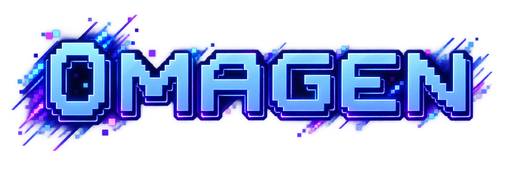
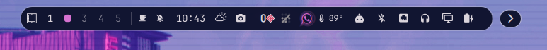
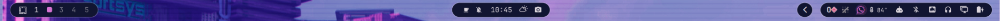
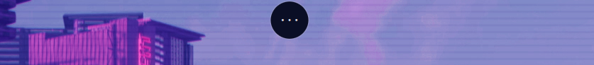
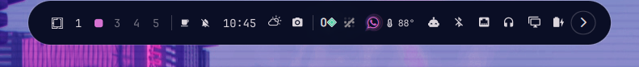
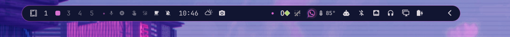
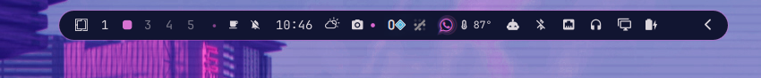

<!-- omagen-product-readme: canonical-source -->


<div align="center">

# Omagen

**Turn an image into an Omarchy desktop that feels like yours.**

Generate a complete theme, explore meaningful variations, preview the result
without committing to it, and apply it safely when it feels right.

[](https://github.com/prettyletto/omagen/actions)
[](README.md)
[](../../LICENSE)

[Get started](#get-started) · [See the workflow](#the-omagen-workflow) · [Browse examples](examples/README.md) · [Read the product docs](#product-documentation)

</div>

<!-- omagen-product-source-only:start -->
> This is the canonical product README source. On `nightly` and `dev`, the
> repository root README intentionally remains developer-facing. The release
> workflow projects this document to the repository root for `main`.
<!-- omagen-product-source-only:end -->


## What is Omagen?

Omagen is an image-to-theme studio for [Omarchy Quattro](https://omarchy.org/).
It turns the colors and atmosphere of a source image into a coherent desktop
direction, then gives you a safe way to judge that direction before it becomes
permanent.

The experience is designed around a simple loop:

```text
image → palette directions → preview or Demo → apply or cancel
```

Omagen is one product suite with two technical plugin packages:

- `pretty.omagen` provides the Studio overlay, image generation, previews,
  Demo, lifecycle, recovery, and the launcher/status widget.
- `pretty.omagen.bar` is the optional full-bar experience for users who want
  Omagen's Bar presets and behavior as their active bar.

They remain separate because Omarchy registers overlays/widgets and full bars
as different plugin kinds. They are presented as one suite, but the full bar
is explicit and opt-in so installing Omagen does not silently replace the
native Quattro bar.

## Why Omagen?

- Start from an image you already like instead of tuning colors from scratch.
- Compare six generated directions: Source, Calm, Mute, Deep, Vibrant, and
  Balanced.
- Preview Window, Shell, Bar, and Animation choices in context when you want
  more than a palette.
- Open a temporary Demo workspace to judge the theme across real desktop
  surfaces.
- Apply a named theme only when you are satisfied—or Cancel and leave the
  current desktop unchanged.
- Recover an interrupted session through the durable session record instead of
  guessing which temporary files are safe to remove.

## The Omagen workflow

### 1. Choose an image

Choose a local image in a common raster format. Omagen extracts representative
colors and keeps the selected image as the visual source for the session.

### 2. Explore directions

Review six palette directions generated by the same production pipeline used by
the applied theme. The gallery is meant to help you choose a mood, not just a
single dominant color.

### 3. Preview safely

Use Live Canvas to inspect the staged result. Use **Test live** for a reversible
desktop preview, or open **Demo** to see the composition across a temporary
editor, terminal, system monitor, and file manager workspace.

### 4. Apply or cancel

**Apply** writes a named permanent theme after the staged session is ready.
**Cancel** restores the original theme, background, and Omagen-owned temporary
resources. **Quit** uses the same recovery path when a session is active.

### 5. Recover when interrupted

If Omagen or the shell is interrupted during a preview or Apply, the next
launch presents an explicit recovery choice. Restore the original desktop or
resume the staged workspace when it can still be verified safely.

## Get started

### Requirements

- Omarchy Quattro
- Hyprland
- Quickshell
- Linux x86_64 for the bundled backend executable

Demo applications are optional. Omagen detects available terminals, editors,
system monitors, and file managers and provides useful fallbacks when a
preferred application is not installed.

### Install from Omarchy

Use Omarchy's plugin manager to install the stable repository:

```sh
omarchy plugin add https://github.com/prettyletto/omagen.git --enable --yes
```

The plugin manager validates the repository manifest and enables the core
Omagen integration. The optional full-bar package remains separately
registered so it can be selected intentionally through Omarchy's normal bar
configuration.

Go is not required for normal use; the runtime backend is bundled with the
plugin.

### Remove Omagen

Remove the packages through Omarchy's plugin manager:

```sh
omarchy plugin remove pretty.omagen --yes
omarchy plugin remove pretty.omagen.bar --yes
```

Removing the plugins does not delete permanent themes created by the user. Do
not manually delete `~/.local/state/omagen` while a session is active; use
Omagen's recovery or uninstall path first.

## See it in action

[](https://youtu.be/Af06-XsdBHA)

Watch the [full Omagen walkthrough on YouTube](https://youtu.be/Af06-XsdBHA)
for the image-to-theme flow, preview paths, Demo, and Apply experience.

## Bar examples

Here are a few examples of the optional Omagen bar direction across different
placements and information densities. The full bar is an opt-in part of the
Omagen suite; installing the core Studio does not silently replace Omarchy's
native bar.

<p align="center">
  
</p>
<p align="center">
  
</p>
<p align="center">
  
</p>
<p align="center">
  
</p>
<p align="center">
  
</p>
<p align="center">
  
</p>
<p align="center">
  
</p>

See the [full bar example gallery](assets/screenshots/bar-examples/README.md)
for the complete set and capture notes.

## Examples

The [v2 example gallery](examples/README.md) pairs source wallpapers with
generated desktop results. It is being curated around the complete v2
workflow, including palette directions, Demo, and optional composition.

## Product documentation

| Guide | What it covers |
| --- | --- |
| [Getting started](getting-started.md) | Installation, first launch, and the shortest path to a theme. |
| [Product workflow](workflow.md) | Preview, Test live, Demo, Apply, Cancel, and Quit. |
| [Capabilities and trust](capabilities.md) | What Omagen can read, write, invoke, and preserve. |
| [Recovery and rollback](recovery.md) | Interrupted sessions, restoration, ownership, and safe removal. |
| [Examples](examples/README.md) | Curated v2 wallpaper/theme pairs and example metadata. |
| [Demo materials](demos/README.md) | Product walkthroughs and the capture plan for v2. |
| [Asset checklist](assets/README.md) | Required screenshots, recordings, examples, and provenance. |
| [v2.0.0 release notes](release-notes/v2.0.0.md) | Release scope, upgrade notes, limitations, and verification status. |

For implementation contracts, contributor setup, compatibility evidence, and
maintainer release procedures, use the [developer documentation](../README.md)
and [release process](../development/release-process.md).

## Trust boundary and capabilities

Omagen is unsandboxed user-level plugin code. It can read the image and Omarchy
configuration you select, write generated themes and Omagen-owned session
state, invoke its bundled backend and explicit user-level adapters, and
interact with the current Omarchy/Hyprland session.

It does not require `sudo`, install system packages, or configure privileged
services. It does not own unrelated themes, shell configuration, backgrounds,
plugins, or user files. Read the [capabilities and trust guide](capabilities.md)
before installing if you want the complete boundary.

The marketplace preflight is a release gate and exact-commit evidence; it is
not a security certification, endorsement, or guarantee. See the developer
[security policy](../../SECURITY.md) and [release process](../development/release-process.md)
for the maintainer-level details.
