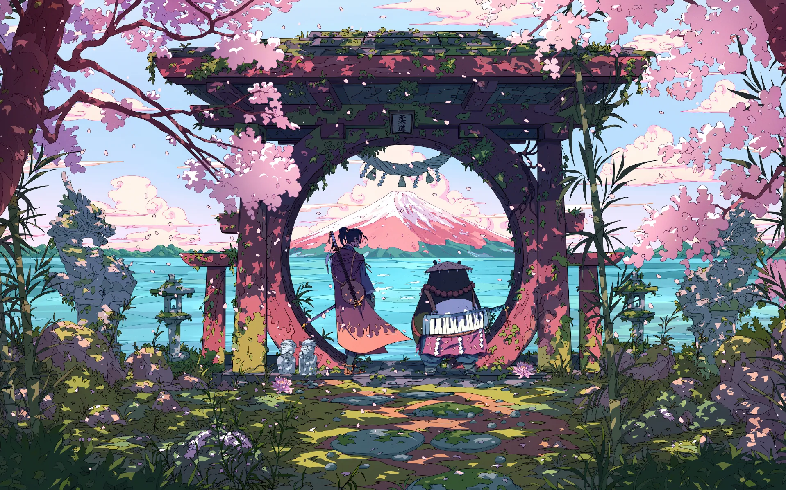

# Product examples

Curate user-facing examples here. Each example pairs a source wallpaper with a
generated desktop result and should explain what the user will see. The current
assets are retained as a baseline while the v2 gallery is recaptured and
reviewed.

| Example | Source wallpaper | Generated result |
| --- | --- | --- |
| Quattro Rules |  |  |
| Ushinawareta |  |  |
| Kanaawesome |  |  |
| NieR:Automata |  |  |
| Neon District |  |  |
| Quiet Platform |  |  |
| Sakura Gate |  |  |
| Eva Deep |  |  |

The curated v2 set should include the source image, the selected palette
direction, the visible composition options, and a clean generated result. Do
not claim a specific recipe or capability unless it was used for that capture.

Implementation fixtures and compatibility snapshots remain in the existing
developer documentation and test directories.
