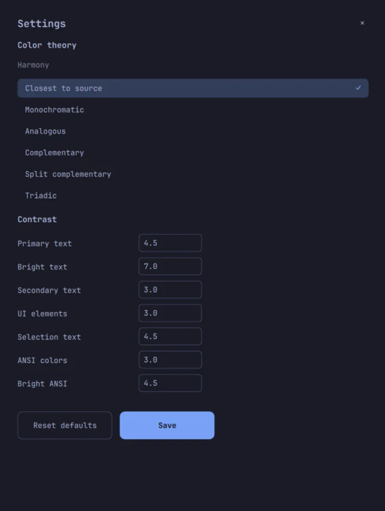
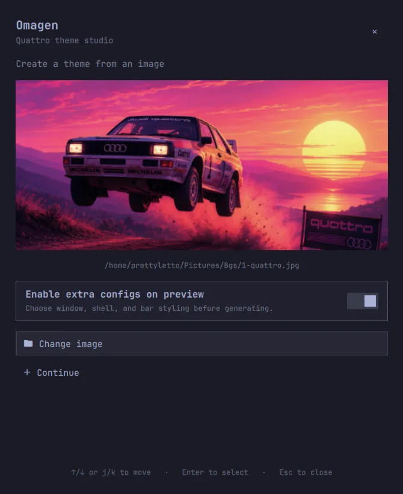
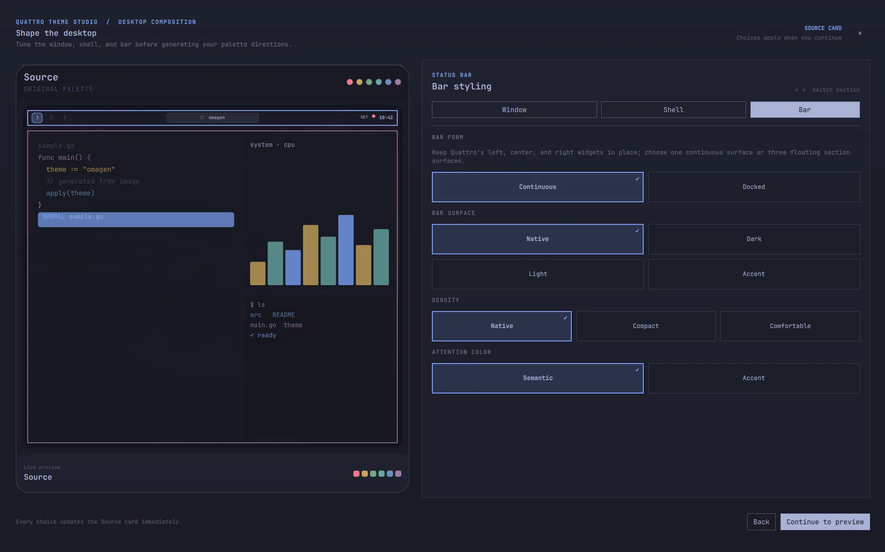
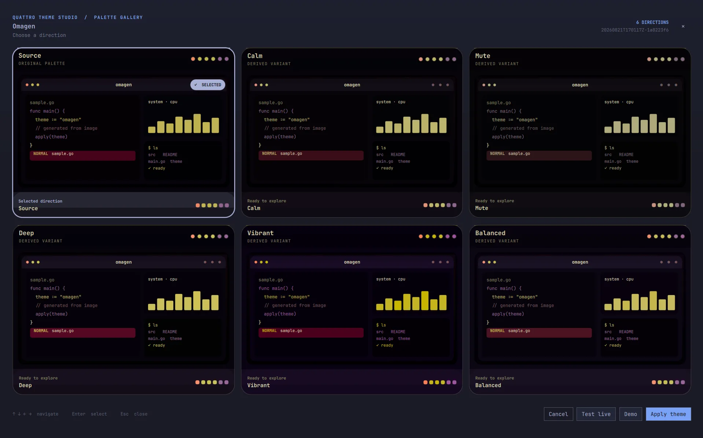

# Usage

Omagen is designed as a short loop:

~~~text
image → palette directions → live preview or Demo → permanent theme
~~~

For a visual tour of the complete workflow, watch the [Omagen video
walkthrough on YouTube](https://youtu.be/Af06-XsdBHA).

## Open Omagen

Click the Omagen widget in the Quattro bar to open the theme studio. The
widget is installed in the right bar section by default and can be moved with
Omarchy's normal bar controls.

Right-click the widget for:

- **Open** — open the theme studio.
- **Settings** — edit palette harmony and contrast preferences.
- **Quit** — close Omagen and restore an active temporary session when one
  exists.

The overlay also supports outside-click dismissal, a close button, arrow-key
navigation, and <code>h/j/k/l</code> navigation. Use <code>Enter</code> or <code>Space</code> to
activate the focused action and <code>Escape</code> to close the current surface.

  

Settings persist the harmony and contrast preferences used by later palette
generations. Reset defaults is available when you want to return to the
baseline values.

## Choose an image

The setup screen starts with **Choose image**. Omagen accepts common raster
formats supported by its image decoder, including PNG, JPEG, GIF, BMP, TIFF,
and WebP. The selected image is used for palette extraction and remains the
source shown in the preview cards.

After choosing an image, you can change it or enable **extra configs on
preview**. Extra configs open a styling step before palette generation; see
[Styling and palette settings](styling.md).

  

## Configure extra desktop previews

When **extra configs on preview** is enabled, Omagen opens a composition step
before generating the six palette directions. Move between the three sections
with the section tabs or <code>h/j/k/l</code> navigation:

- **Window** controls the active border, border thickness, corner shape, pane
  spacing, depth, and how inactive windows recede (native, shadowed, or
  blurred).
- **Shell** controls surface composition, focus/detail language, and tooltip or
  notification feedback surfaces.
- **Bar** controls the form, surface, density, attention color, and Docked
  visibility policy while preserving native Quattro layout behavior.

Every choice updates the source card immediately. Choose **Continue to
preview** when the composition looks right; these settings become part of the
generated preview and applied theme.

## Explore palette directions

Omagen generates six directions from the same source image:

- **Source** — the closest representation of the extracted palette.
- **Calm** — a quieter, less aggressive interpretation.
- **Mute** — a more restrained version with reduced intensity.
- **Deep** — a darker, more atmospheric direction.
- **Vibrant** — a stronger, more expressive direction.
- **Balanced** — a middle-ground interpretation between source character and
  usability.

Select a card to make it the active direction. The gallery can be navigated
with the arrow keys or <code>h/j/k/l</code> and activated with <code>Enter</code> or <code>Space</code>.

Omagen applies semantic contrast processing to the generated palette before
it reaches the gallery, so the preview represents the palette that will be
used by the generated theme rather than an earlier intermediate result.

  

## Test a direction live

**Test live** applies the selected direction temporarily through Omarchy's
theme system. It does not create the permanent user theme yet. The temporary
theme and the original theme/background are tracked by an active Omagen
session.

Use **Cancel** when you are finished testing. Omagen restores the original
theme and background before clearing the session.

## Open the Demo workspace

**Demo** opens a temporary workspace containing the applications that Omagen
can resolve on the current machine. It is useful when a palette looks good in
a card but needs to be judged across real desktop surfaces.

When Demo is open, the button becomes **Dispatch**. Dispatch closes the
tracked Demo windows and returns to the normal desktop workspace. See the
[Demo workspace guide](demo.md) for details.

## Apply a theme

Choose **Apply theme** to open the save dialog. Enter a name for the permanent
Omarchy theme and choose any optional outputs:

- **Generate unlock screen** creates Plymouth unlock artwork and its preview.
- **Capture live Demo preview** uses the loaded Demo workspace as the theme's
  <code>preview.png</code>.

Choose **Save & Apply** to publish the generated theme and select it through
Omarchy. Apply is staged so an interrupted operation can be recovered; see
[Recovery and safety](recovery.md).

## Cancel, Quit, and recovery

Cancel from the gallery restores the original desktop. Closing the overlay is
not the same as abandoning the session: Omagen keeps the durable session state
until the session is applied, canceled, or recovered.

If a previous session is found on the next launch, Omagen shows **Recover
Omagen**. Choose **Restore & close** to restore the original theme and
background, or **Resume** when the generated workspace is still available.
